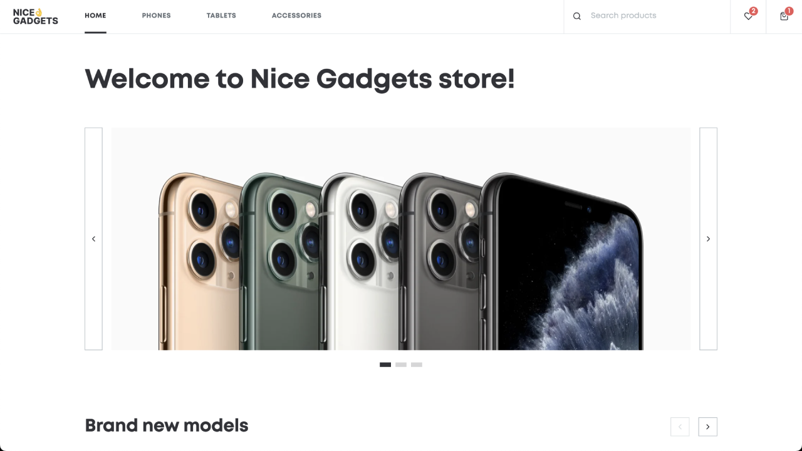

# Nice Gadgets — Apple Store



[LIVE DEMO](https://ruslanpashkov.com/projects/nice-gadgets/)

A full-stack e-commerce application for Apple products with a REST API backend and React frontend.

## Features

- Product catalog with categories
- Product details with color and memory options
- Search functionality
- Shopping cart
- Favorites list
- Recommended products section
- New and discounted products sections

## Tech Stack

- TypeScript
- React + Vite
- React Router
- Sass (SCSS)
- Node.js + Express
- PostgreSQL + Sequelize
- SWC
- Swiper

## API Endpoints

### Product Endpoints

- `GET /products` - Get products by category
- `GET /products/:deviceId` - Get product details
- `GET /products/count` - Get total products count
- `GET /products/new` - Get new products
- `GET /products/discount` - Get discounted products
- `GET /products/recommended` - Get recommended products
- `GET /products/search` - Search products

### Order Endpoints

- `POST /orders` - Add new order
- `GET /orders/:id` - Get order details

## Setup

1. Clone the repository:

```bash
git clone https://github.com/ruslanpashkov/nice-gadgets.git
```

2. Install dependencies:

```bash
pnpm install
```

3. Configure database:

- Set up PostgreSQL
- Add required environment variables in `packages/server/.env`

1. Start development servers:

```bash
pnpm dev
```

- Frontend: http://localhost:5173
- Backend: http://localhost:5000

## License

[GNU GENERAL PUBLIC LICENSE](LICENSE)
